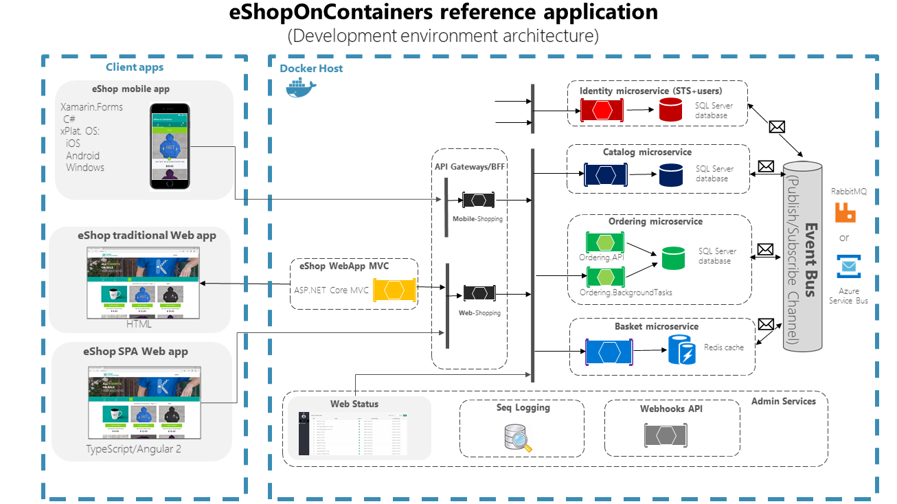

<a href="https://dot.net/architecture">
   
</a>

# .NET Microservices Sample Reference Application

Sample .NET Core reference application, powered by Microsoft, based on a simplified microservices architecture and Docker containers.

## SPA Application (Angular)


## Build Status (GitHub Actions)

| Image | Status | Image | Status |
| ------------- | ------------- | ------------- | ------------- |
| Web Status |  [](https://github.com/dotnet-architecture/eShopOnContainers/actions?query=workflow%3Awebstatus) | Shopping Aggregator (Web) | [](https://github.com/dotnet-architecture/eShopOnContainers/actions?query=workflow%3Awebshoppingagg) |
| Basket API | [](https://github.com/dotnet-architecture/eShopOnContainers/actions?query=workflow%3Abasket-api) | Shopping Aggregator (Mobile) | [](https://github.com/dotnet-architecture/eShopOnContainers/actions?query=workflow%3Amobileshoppingagg) |
| Catalog API | [](https://github.com/dotnet-architecture/eShopOnContainers/actions?query=workflow%3Acatalog-api) | Web Client (MVC) | [](https://github.com/dotnet-architecture/eShopOnContainers/actions?query=workflow%3Awebmvc) |
|Identity API | [](https://github.com/dotnet-architecture/eShopOnContainers/actions?query=workflow%3Aidentity-api) | Web Client (SPA) | [](https://github.com/dotnet-architecture/eShopOnContainers/actions?query=workflow%3Awebspa) |
| Ordering API | [](https://github.com/dotnet-architecture/eShopOnContainers/actions?query=workflow%3Aordering-api) | Webhooks Client | [](https://github.com/dotnet-architecture/eShopOnContainers/actions?query=workflow%3Awebhooks-client) |
| Payment API | [](https://github.com/dotnet-architecture/eShopOnContainers/actions?query=workflow%3Apayment-api) | Ordering SignalR | [](https://github.com/dotnet-architecture/eShopOnContainers/actions?query=workflow%3Aordering-signalrhub) | |


## Getting Started

Make sure you have [installed](https://docs.docker.com/docker-for-windows/install/) and [configured](https://github.com/dotnet-architecture/eShopOnContainers/wiki/Windows-setup#configure-docker) docker in your environment. After that, you can run the below commands from the **/src/** directory and get started with the `eShopOnContainers` immediately.

```powershell
docker-compose build
docker-compose up
```

You should be able to browse different components of the application by using the below URLs :

```
Web Status : http://host.docker.internal:5107/
Web MVC :  http://host.docker.internal:5100/
Web SPA :  http://host.docker.internal:5104/
```

>Note: If you are running this application in macOS then use `docker.for.mac.localhost` as DNS name in `.env` file and the above URLs instead of `host.docker.internal`.

Below are the other avenues to setup *eShopOnContainers*.

### Basic scenario

The basic scenario can be run locally using docker-compose, and also deployed to a local Kubernetes cluster. Refer to these Wiki pages to Get Started:


- [Visual Studio (F5 experience)](https://github.com/dotnet-architecture/eShopOnContainers/wiki/Windows-setup#optional---use-visual-studio)
- [Docker compose on windows](https://github.com/dotnet-architecture/eShopOnContainers/wiki/Windows-setup)
- [Docker compose on macOS](https://github.com/dotnet-architecture/eShopOnContainers/wiki/Mac-setup)
- [Local Kubernetes](https://github.com/dotnet-architecture/eShopOnContainers/wiki/Deploy-to-Local-Kubernetes)

### Advanced scenario

The advanced scenario deploys the project to Azure.
Must have azure account and [az-cli](https://docs.microsoft.com/en-us/cli/azure/install-azure-cli) installed,[terraform-cli](https://learn.hashicorp.com/tutorials/terraform/install-cli)

##### 1. Create Terraform Backend and Service Principal

Follow the instruction to create an storage account and a service principal described in the file:
> [deploy/terraform/infra/service_principal/storage.azcli](deploy/terraform/infra/service_principal/storage.azcli)


##### 2. Manually create Vm for Vault & Packer


##### 3. Configure vault with Ansible


##### 4. Manually store credentials in Github Actions Secrets


##### 5. Push change in terraform to trigger Pipeline


##### 6. Upload docker images -> aks


##### 7. Be happy


### Architecture overview

This reference application is cross-platform at the server and client-side, thanks to .NET 6 services capable of running on Linux or Windows containers depending on your Docker host, and to Xamarin for mobile apps running on Android, iOS, or Windows/UWP plus any browser for the client web apps.
The architecture proposes a microservice oriented architecture implementation with multiple autonomous microservices (each one owning its own data/db) and implementing different approaches within each microservice (simple CRUD vs. DDD/CQRS patterns) using HTTP as the communication protocol between the client apps and the microservices and supports asynchronous communication for data updates propagation across multiple services based on Integration Events and an Event Bus (a light message broker, to choose between RabbitMQ or Azure Service Bus, underneath) plus other features defined at the [roadmap](https://github.com/dotnet-architecture/eShopOnContainers/wiki/Roadmap).




For more free e-Books check out [.NET Architecture center](https://dot.net/architecture). If you have an e-book feedback, let us know by creating a new issue here: <https://github.com/dotnet-architecture/ebooks/issues>
